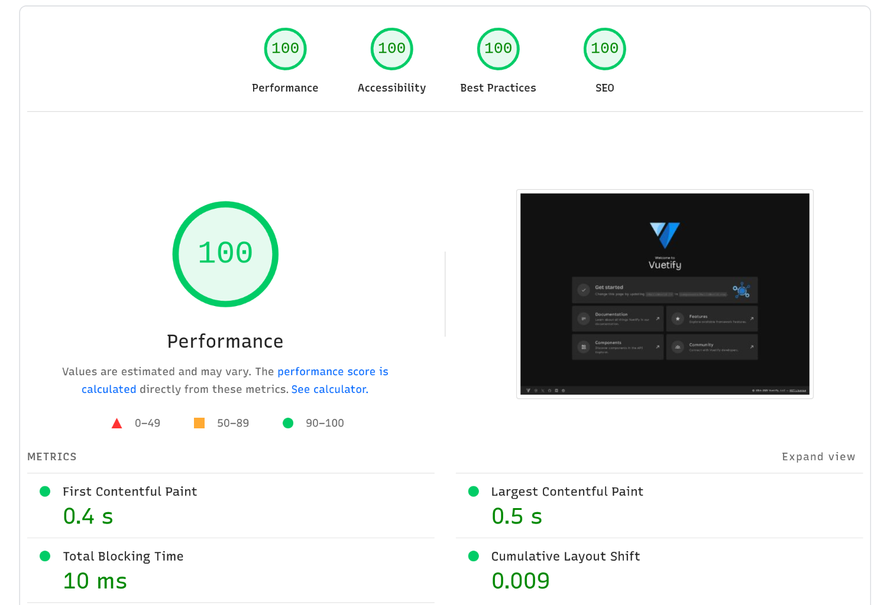

# Vuetify + Nuxt Boilerplate

Look at the [Nuxt documentation](https://nuxt.com/docs/getting-started/introduction) to learn more.

## Setup

Make sure to install dependencies:

```bash
pnpm install
pnpm dev
```

Build the application for production:

```bash
pnpm build
pnpm preview
```

---


